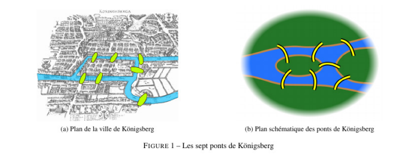
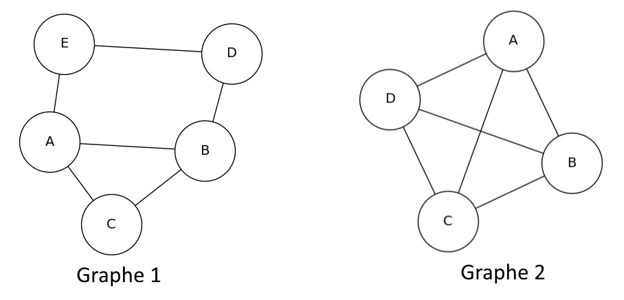
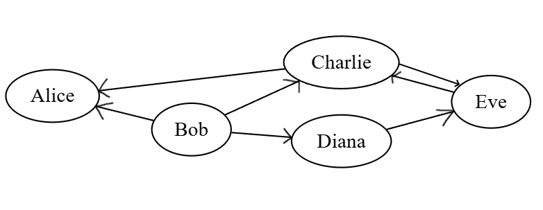
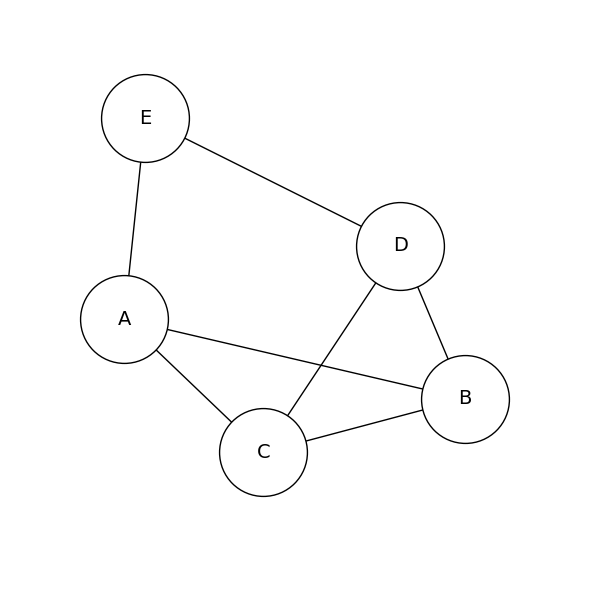

# Graphes

## 1 - Origine 

Le concept de graphe a été introduit par le mathématicien Leonhard Euler en 1735 pour résoudre le problème des ponts de Königsberg. Les habitants se demandaient s’il existe ou non une promenade dans les rues de Königsberg permettant, à partir d’un point de départ au choix, de passer une et une
seule fois par chaque pont et de revenir à son point de départ, étant entendu qu’on ne
peut traverser la Pregel qu’en passant sur les ponts.



Depuis, les graphes sont des structures de données essentielles en informatique, permettant de modéliser des relations entre des éléments. Que ce soit pour représenter un réseau routier, un réseau électrique, Internet, des relations sociales, etc...

## 2 - Vocabulaire général


> 
>
> **Figure 1**: exemple de représentation d’un graphe d'amis, d'ordre 5 (Un sommet = une personne) et de taille 6 (Une arête = une relation d’amitié entre deux personnes).

* Un **graphe** est composé d’un ensemble de **sommets** et d'un ensemble d'**arêtes** (ou **arcs**). Il s'agit d'une représentation d'un ensemble de relations entre des entités.
On le note G = (S, A) où S est un ensemble fini de sommets et A un ensemble fini d'arêtes représentées par des couples de sommets.
Par exemple dans la figure 1, le graphe G = (S, A) avec S = {Alice, Bob, Charlie, Diana, Eve} et A = {(Alice, Bob), (Alice, Charlie), (Bob, David), (Charlie, David), (David, Eve), (Bob, Eve)}.
* Un **sommet** représente l'entité, souvent désignée par un cercle dans les représentations graphiques.
* Une **arête** représente la relation entre deux sommets, souvent désignée par une ligne ou une flèche reliant deux cercles.
* **L'ordre** du graphe est le nombre de sommets qu'il contient.
* La **taille** du graphe est le nombre d'arêtes qu'il contient.

> **Remarque** : Un graphes peut contenir des **arêtes multiples** et des **boucles**. Une arête multiple est une arête qui relie les mêmes sommets que d'autres arêtes. Une boucle est une arête qui relie un sommet à lui-même. Si il n'y a aucun de ces deux cas, on dit que le graphe est **simple**. Nous travaillerons uniquement avec des graphes simples.

Il existe deux types de graphes : les graphes orientés et les graphes non orientés. Nous allons les détailler ci-dessous.

## 3 - Graphes non orientés

Un graphe non orienté est un graphe dans lequel les arêtes n'ont pas de direction. Par exemple, dans la figure 1, les arêtes représentent des relations d'amitié réciproques : si Alice est amie avec Bob, alors Bob est également ami avec Alice.

* On dit que deux sommets sont **adjacents** s'ils sont reliés par une arête.
Par exemple, Alice et Bob sont adjacents.
* Les **voisins** d'un sommet sont les sommets qui lui sont adjacents.
Par exemple, les voisins de Bob sont Alice, Charlie et Diana.
* On appelle **degré** d'un sommet, son nombre de voisins.
Par exemple, le degré de Bob est 3.

> 
>
> **Figure 2**: Graphe non orientés

Question : 
* Pour chaque graphe, donner son ordre et sa taille.
* Est-ce que les couples de sommets suivants sont adjacents ou non :
  * Graphe 1 : (A, B), (A, D), (C, E)
  * Graphe 2 : (A, C), (B, D), (C, D)
* Recopiez et complétez le tableau des degrés des sommets pour chaque graphe:

| Sommet | Degré Graphe 1 | Degré Graphe 2 |
| :----: | :------------: | :------------: |
|   A    |                |                |
|   B    |                |                |
|   C    |                |                |
|   D    |                |                |
|   E    |                |Pas de sommet E |

* Une **chaine** est une suite de sommets tels que chaque sommet est adjacent au suivant. Par exemple, le graphe 1 de la figure 2, une chaîne possible est A - E - D - B - C ou encore C - A - B.
* Un **cycle** est une chaîne qui commence et se termine au même sommet.
* La **distance** entre deux sommets est la chaine la plus courte qui les relies.

Question : 
* Donner une chaîne de longueur 4 dans chacun des graphes.
* Donner un cycle qui passe par tout les sommets dans chacun des graphes.
* Quelle est la distance entre les sommets D et C dans chacun des graphes ?


## 4 - Graphes orientés

Les graphes orientés ont un fonctionnement différent : ce sont des graphes dans lequel les arêtes ont une direction et sont nommées **arcs**. Reprenons notre 1er graphe, mais cette fois-ci en représentant des relations de type "suivre" sur un réseau social. Si Bob suit Alice, cela ne signifie pas nécessairement que Alice suit Bob.

Plusieurs notions changent dans le vocabulaire des graphes orientés :

* On ne parle plus de sommets adjacents, mais de **successeurs** et de **prédécesseurs**. Pour un graphe orienté, un couple de sommets (u, v) est un **arc allant de u vers v**, v est donc un successeur de u et que u est un prédécesseur de v. Un sommet peut être à la fois prédécesseur et successeur d’un autre sommet. Dans notre exemple, 
Bob est un prédécesseur ET un successeur d’Alice.
* On ne parle plus de chaine, mais de **chemin** dans un graphe orienté et la **distance** entre deux sommets devient donc le chemin le plus court qui les relies.

> **Remarque** : La notion de voisin ne change pas, le nombre de voisins dans un graphe orienté correspond au nombre de voisins quand on transforme tout les arcs en arêtes, on peut également définir le **degré entrant** (nombre de prédécesseurs) et le **degré sortant** (nombre de successeurs) d'un sommet.

> 
>
> **Figure 3**: Graphe de suivi dans un réseau social.

Question :
* Dans notre réseau social, Qui sont les personnes suivies par Bob ? Que sont ses personnes pour Bob ?
* Qui sont les personnes qui suivent Alice ? Que sont ses personnes pour Alice ?
* Qui est la personne la plus suivie ?
* Quelle est la distance entre Eve et Alice ? 
* Existe-t-il un chemin entre Alice et Eve ? 
* Existe-t-il un cycle dans ce graphe ?
* Recopiez et complétez le tableau des degrés entrants et sortants des sommets :

| Sommet | Degré entrant | Degré sortant | Degré |
| :----: | :------------: | :------------: | :----: |
|   Alice   |                |                |        |
|   Bob    |                |                |        |
|   Charlie    |                |                |        |
|   Diana    |                |                |        |
|   Eve    |                |                |        |
## 5 - Implémentations

Maintenant nous savons ce qu'est un graphe et son vocabulaire autour. Mais comment pouvons nous les représenter en python ? Il existe deux principales façons de représenter un graphe : la matrice d'adjacence et les listes d'ajacence.

### Matrice d'adjacence

On peux représenter un graphe par une matrice carrée appelée matrice d'adjacence. Si le graphe a n sommets, on construit une matrice de taille n x n (une liste de listes en python), qui contient des 0 et des 1. Si il y a une arête ou un arc du sommet i vers le sommet j, on met un 1 à la position (i, j) de la matrice, sinon on met un 0.

Pour notre graphe de suivi (figure 3), On peut commencer par construire un tableau :

|   |      Alice     |  Bob | Charlie | Eve | Diana |
| :---------------:|:---------------:|:-----:|:-----:|:-----:|:-----:|
| **Alice**  |   0        |  0 | 0 | 0 | 0 |
|**Bob**| 1             |   0 | 1 | 0 | 1 |
| **Charlie**  | 1         |    0 | 0 | 1 | 0 |
| **Eve**  | 0          |    0 | 1 | 0 | 0 |
| **Diana**  | 0          |    0 | 0 | 1 | 0 |

On obtient donc la matrice d'adjacence suivante :

```python
matrice_adjacence = [
    [0, 0, 0, 0, 0],  # Alice
    [1, 0, 1, 0, 1],  # Bob
    [1, 0, 0, 1, 0],  # Charlie
    [0, 0, 1, 0, 0],  # Eve
    [0, 0, 0, 1, 0]   # Diana
]
```

Question :
* A quoi correspond la valeur de la case matrice_adjacence[1][2] ?
* Pourquoi la diagonale de la matrice est-elle composée uniquement de 0 ?

> 
>
> **Figure 4**: Graphe non orienté.

Question :
* Construire la matrice d'adjacence du graphe non orienté.
* La matrice d'adjacence d'un graphe non orienté possède une propriété intéressante : regardez votre matrice sous et au dessus de la diagonale (de la case en haut à gauche à la case en bas à droite). Que remarquez-vous ? Pourquoi ?

### Listes d'ajacence

Une autre façon de représenter un graphe est d'utiliser des listes d'ajacence. Pour chaque sommet, on crée une liste qui contient tous les sommets adjacents (ou suivis dans le cas d'un graphe orienté).


