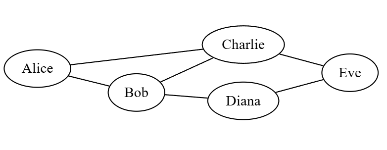

# Graphes

## 1 - Origine 

Le concept de graphe a été introduit par le mathématicien Leonhard Euler en 1735 pour résoudre le problème des ponts de Königsberg. Les habitants se demandaient s’il existe ou non une promenade dans les rues de Königsberg permettant, à partir d’un point de départ au choix, de passer une et une
seule fois par chaque pont et de revenir à son point de départ, étant entendu qu’on ne
peut traverser la Pregel qu’en passant sur les ponts.

Depuis lors, les graphes sont devenus un outil fondamental en mathématiques et en informatique pour modéliser des relations entre des objets. Les graphes sont des structures de données essentielles en informatique, permettant de modéliser des relations entre des éléments. Que ce soit pour représenter un réseau routier, un réseau électrique, Internet ou des relations sociales.

## 2 - Vocabulaire général

> 
>
> **Figure 1**: exemple de représentation d’un graphe d'amis, d'ordre 5 (Un sommet = une personne) et de taille 6 (Une arête = une relation d’amitié entre deux personnes).

> * Un **graphe** est composé d’un ensemble de **sommets** et d'un ensemble d'**arêtes** (ou **arcs**). Il s'agit d'une représentation d'un ensemble de relations entre des entités.
> On le note G = (S, A) où S est un ensemble fini de sommets et A un ensemble fini d'arêtes représentées par des couples de sommets.
> Par exemple dans la figure 1, le graphe G = (S, A) avec S = {Alice, Bob, Charlie, Diana, Eve} et A = {(Alice, Bob), (Alice, Charlie), (Bob, David), (Charlie, David), (David, Eve), (Bob, Eve)}.
> * Un **sommet** représente l'entité, souvent désignée par un cercle dans les représentations graphiques.
> * Une **arête** représente la relation entre deux sommets, souvent désignée par une ligne ou une flèche reliant deux cercles.
> * **L'ordre** du graphe est le nombre de sommets qu'il contient.
> * La **taille** du graphe est le nombre d'arêtes qu'il contient.

Il existe deux types de graphes : les graphes orientés et les graphes non orientés. Nous allons les détailler ci-dessous.

## 3 - Graphes non orientés

Un graphe non orienté est un graphe dans lequel les arêtes n'ont pas de direction. Par exemple, dans la figure 1, les arêtes représentent des relations d'amitié réciproques : si Alice est amie avec Bob, alors Bob est également ami avec Alice.

> * On dit que deux sommets sont **adjacents** s'ils sont reliés par une arête.
> Par exemple, Alice et Bob sont adjacents.
> * Les **voisins** d'un sommet sont les sommets qui lui sont adjacents.
> Par exemple, les voisins de Bob sont Alice, Charlie et Diana.
> * On appelle **degré** d'un sommet, son nombre de voisins.
> Par exemple, le degré de Bob est 3.

> 
>
> **Figure 2**: Graphe non orientés

Question : 
* Pour chaque graphe, donner son ordre et sa taille.
* Est-ce que les paires sommets suivants sont adjacents ou non :
  * Graphe 1 : (A, B), (A, D), (C, E)
  * Graphe 2 : (A, C), (B, D), (C, D)
* Pour les sommets C, donner leurs degrés et leurs voisins.

> * Une **chaine** est une suite de sommets tels que chaque sommet est adjacent au suivant. Par exemple, le graphe 1 de la figure 2, une chaîne possible est A - E - D - B - C ou encore C - A - B.
> * Un **cycle** est une chaîne qui commence et se termine au même sommet.

Question : 
* Donner une chaîne de longueur 4 dans chacun des graphes.
* Donner un cycle qui passe par tout les sommets dans chacun des graphes.

## 4 - Graphes orientés

A l'inverse, un graphe orienté est un graphe dans lequel les arêtes ont une direction et sont nommées **arcs**. Reprenons notre 1er graphe, mais cette fois-ci en représentant des relations de type "suivre" sur un réseau social. Si Bob suit Alice, cela ne signifie pas nécessairement que Alice suit Bob.

> 
>
> **Figure 3**: Graphe de suivi dans un réseau social.

Question :
* Dans notre réseau social, Qui sont les personnes suivies par Bob ?
* Qui sont les personnes qui suivent Alice ?
* Qui est la personne la plus suivie ?

## 5 - Implémentations

### Matrice d'adjacence

### Listes d'ajacence

## 6 - Parcours de graphe